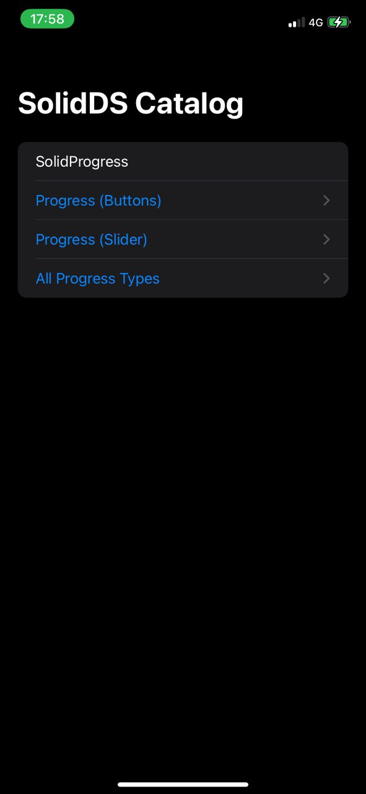
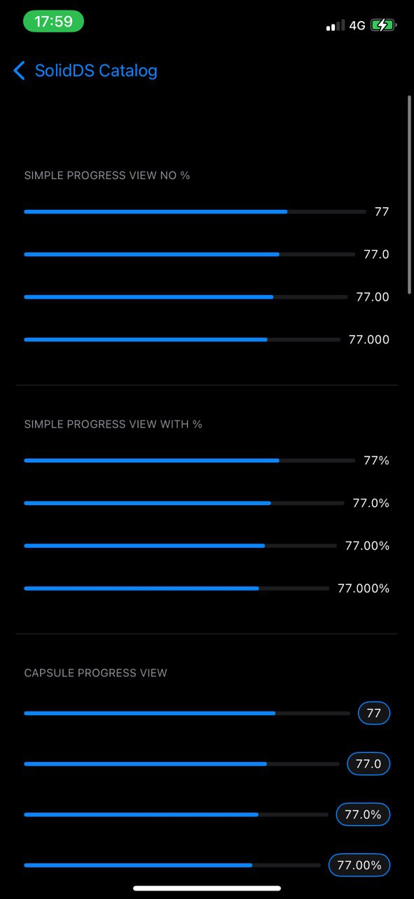
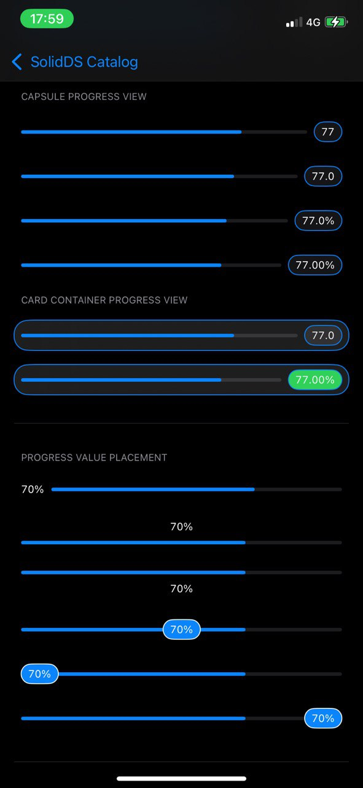
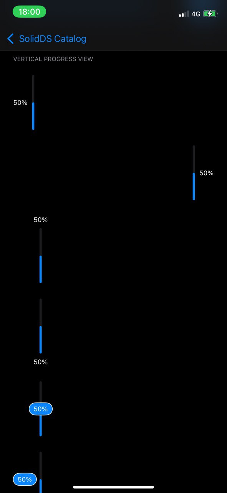

# SolidDS


A lightweight SwiftUI design system providing reusable components, design tokens, and UI primitives for building consistent apps.

## Features

- Reusable SwiftUI components
- Design tokens (colors, spacing, typography)
- Modular architecture
- Swift Package Manager support
- Demo catalog app

## Installation

Add the package using Swift Package Manager:

```swift
.package(url: "https://github.com/NikolaiBorisov/SolidDS.git", from: "0.5.0")
```

Or add it in Xcode:

File → Add Package Dependencies

```swift
https://github.com/NikolaiBorisov/SolidDS
```

## Highlight: SolidProgress

A highly customizable SwiftUI progress component supporting:

- Linear and circular styles
- Horizontal and vertical orientation
- Flexible value positioning (leading, trailing, top, bottom, overlay)
- Capsule and text value styles
- Customizable colors, spacing, and sizes
  
## Usage

```swift
import SolidDS

struct ContentView: View {
    var body: some View {
        SolidProgress(
            value: 0.77,
            valueFormat: .integer(percent: false),
            valueColor: .blue,
            progressType: .linear
        )
        .padding()
    }
}
```

## Components

- Progress indicators
- Reusable UI primitives

## Demo Screenshots

Here’s a preview of the `SolidProgress` component in action:








## Why SolidDS?

SolidDS helps you build consistent SwiftUI apps faster by providing 
ready-to-use components with flexible APIs and sensible defaults.

It’s designed to scale from simple apps to full design systems.
